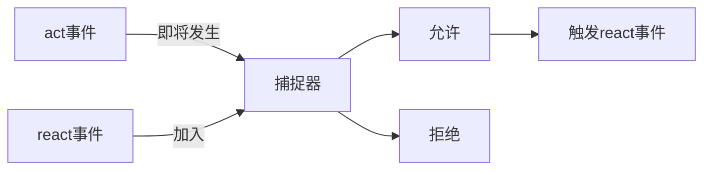

# 事件捕捉

用于捕捉事件并作出反应的模块。

具体监听与反应流程如下。

```mermaid
flowchart LR
act事件 -- 即将发生 --> 捕捉器 --> 允许 -->  触发react事件
捕捉器 --> 拒绝
react事件 -- 加入 --> 捕捉器
```

其中，act事件是主动事件，react事件是由act事件触发的事件。

该模块将会用于 [码卡 - ByteBlitz](https://github.com/JeremyHe1209/ByteBlitz)。